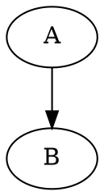

# latex-template

To create a new project by using this template execute:

```bash
	proj="new"
	mkdir -p "${HOME}/Projects/Latex/${proj}"
	cd "${HOME}/Projects/Latex/${proj}"
	git init
	git add submodule https://github.com/arturasl/latex-template.git latex-template
	cd latex-template/scripts
	./init.bash
```

This will create a new project called "new" in Projects/Latex directory and fill it with some stub files.

In order to build project install [Vagrant] and [VirtualBox]. After that you should be able to execute `make` in project root to build your project.

# Automatic pdf generation

This template will automatically generate `pdf` files from various formats and allow to easily import them to your project.

## [DIA]

Place all your `*.dia` files in `dia` directory. They will be accesable in `LaTeX` by macro:

```latex
\includeobj{dia:yourfile}
```

## [Graphviz]

Place all your `*.dot` files in `dot` directory. They will be accessible in `LaTeX` by macro:

```latex
\includeobj{dot:yourfile}
```

`*.dot` files may include command which will be used for converting individual `*.dot` files.
Place such command on the first line of file as a comment:



## [Inkscape]

Same as [Dia], but use [Inkspace].

## PNG

Same as [Dia], but use `png` image format.

## [gnuplot]

This template allows to easily create [gnuplot] line plots.
In order to do that put `*.csv` files of form:

```csv
X axis label,Y axis label,additional parameters to `pdfcairo` terminal if any
Line 1 label,Line 2 label,...,Line n label
x val 1,line 1 y(x1), line 2 y(x1), ... line n y(x1)
x val 2,line 1 y(x2), line 2 y(x2), ... line n y(x2)
...
x val m,line 1 y(xm), line 2 y(xm), ... line n y(xm)
```

to `gpline` directory and add this macro to your `LaTeX` file:

```latex
\includeobj{gpline:yourfile}
```

## Code

Insert highlighted code by adding code files to `pseudocode` directory and putting comment to them, indicating which formater to use.
For example:

```sql
-- sqlcode
select * from my table
```

to include generated `pdf` file to `LaTeX` use:

```latex
\includeobj{pseudocode:yourfile}
```

[Vagrant]: http://www.vagrantup.com/
[VirtualBox]: https://www.virtualbox.org/
[Dia]: https://wiki.gnome.org/Apps/Dia/
[Graphviz]: http://graphviz.org/
[Inkscape]: http://inkscape.org/
[gnuplot]: http://www.gnuplot.info/
